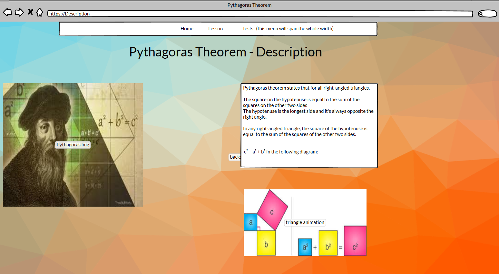
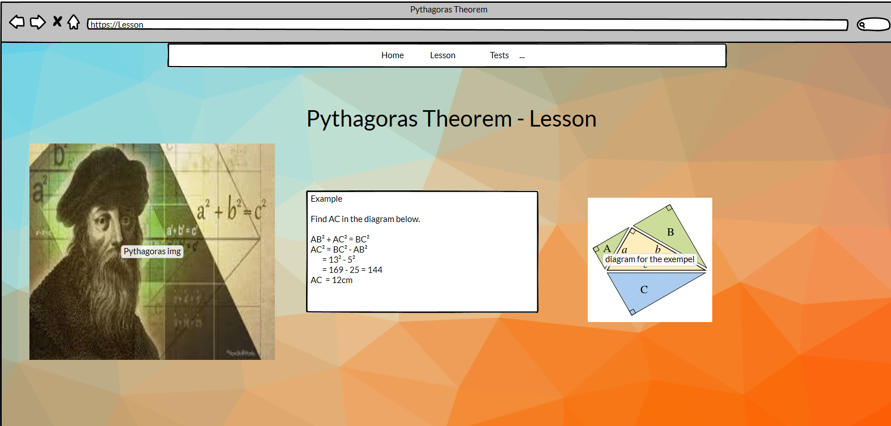
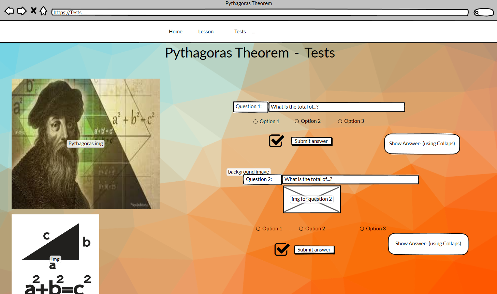
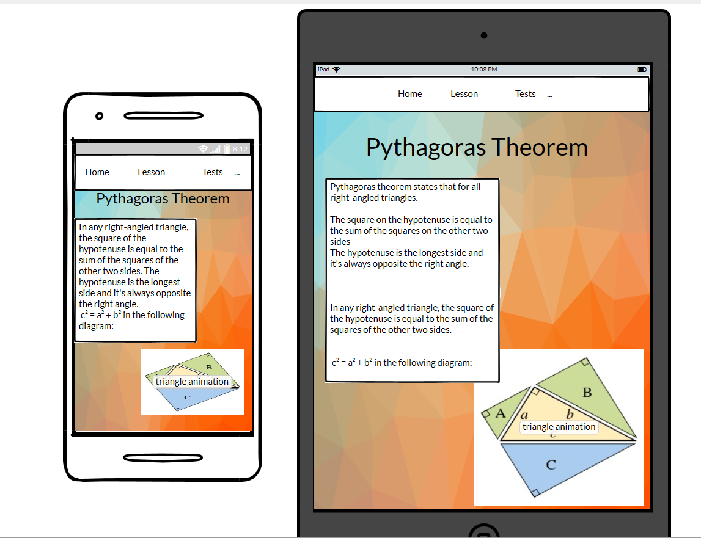

# Lesson---Pythagoras-Theorem #

This is a basic lesson teaching Pythagora's theorem.
 
This lesson is presenting Pythagora's theorem for pupils in the 7th grade.

## UX ##

i. STRATEGY PLANE

My goal is to provide educational material for helping teachers with their private lessons.

### Users stories: ###

As a... | I want to... | To be able to...
---------|--------------|--------------
User | Understand Pythagora Theorem | To demonstrate knowledge at school
User | Practice with excercises | Test my knowledge
User | Have a readable lesson | Easily understand the info presented
User | See my test results | Have feedback on my learning progress
----- |-------------------| -----------------------------------
   
ii. SCOPE PLANE

### Features: ###

1. Task bar at the top - helping user to easily navigate to diferent pages.
* Fixed navigation bar visible on every page including a dropdown menu.
2. Images with Pythagora's teorem which bring more ease to understand the lesson.
3. The video from the "Lesson" page is to capture the pupil's attention to the lesson and make the lesson more interesting.
4. Buttons in the "Exercises" page for the pupil to test him/herself  att the end of the lesson. 
* There are buttons that are providing correct answers as well for test feedback.

## Features Left to Implement ##

One of the improvments that can be done is to provide a submit button for the "Exercises" page and use JavaScript to auto-grade the test.

iii. STRUCTURE PLANE

The **Lesson---Pythagoras-Theorem** is structured in three pages:

1. **Description** is the *first page* of **Lesson---Pythagoras-Theorem**. 

The following pieces of information are on this page:
* A basic presentation of Pythagora's theorem;
* Pythagora's picture;
* Formula for the theorem;
* A colorful image that presents the formula in a more pleasant way for the pupil.

2. **Lesson** is the *second page* of **Lesson---Pythagoras-Theorem**.

The following pieces of information are on this page:

* A lesson in which the theorem is presented with an example of how to calculate a triangle's side using the theorem.
* A video where another exemple is presented in order for pupil to understand the theorem.
* A suggestive image that presents the formula for the pupil.

3. **Exercises** is the *third page* of **Lesson---Pythagoras-Theorem**.

The following pieces of information are on this page:

* Three exercises where the pupil can test the knowledge of the theorem.
* Possibility for the pupil to fill in an answer calculated by him/herself.
* Possibility for the pupil to choose the correct answer.
* A suggestive image with the purpose of helping to better calculate the formula for the exercises.

iv. SKELETON PLANE

**Wireframes**:

v. SURFACE PLANE

In the **Lesson---Pythagoras-Theorem**

The pupil will easily understand the info presented.

The pupil will practice with excercises.

The color of the backgroud, video, images will capture the pupil's attention to the lesson and make the lesson more interesting.

## Technologies Used ##

**Languages Used**

* The app was created using HTML5 styled with custom CSS3 styles.
* The logic scripts were written in JavaScript.

**Frameworks, Libraries & Programs Used**

1. [Bootstrap 4.6:](https://getbootstrap.com/docs/4.6/getting-started/introduction/)
* Bootstrap 4.6 css was used to create the navigation bar, as well as 'Exercises' page, responsive design, etc.
2. [Google Fonts:](https://fonts.google.com/)
* Google fonts were used to import the Roboto font into the style.css file which is used on all text elements of the app.
3. [Git:](https://azure-loon-ay9p18v0.ws-eu03.gitpod.io/#/workspace/Lesson---Pythagoras-Theorem)
* Git was used for version control by commiting to local repository and pushing to GitHub.
4. [GitHub:](https://github.com/)
* GitHub was used to store the project's code after being pushed from local repository.
5. [Balsamic:](https://balsamiq.com/wireframes/desktop/#)
* Balsamic was used to create the wireframes shown above for the front end design.

##Testing##

In this section, you need to convince the assessor that you have conducted enough testing to legitimately believe that the site works well. Essentially, in this part you will want to go over all of your user stories from the UX section and ensure that they all work as intended, with the project providing an easy and straightforward way for the users to achieve their goals.
Whenever it is feasible, prefer to automate your tests, and if you've done so, provide a brief explanation of your approach, link to the test file(s) and explain how to run them.
For any scenarios that have not been automated, test the user stories manually and provide as much detail as is relevant. A particularly useful form for describing your testing process is via scenarios, such as:
1.	Contact form:
i.	Go to the "Contact Us" page
ii.	Try to submit the empty form and verify that an error message about the required fields appears
iii.	Try to submit the form with an invalid email address and verify that a relevant error message appears
iv.	Try to submit the form with all inputs valid and verify that a success message appears.
In addition, you should mention in this section how your project looks and works on different browsers and screen sizes.
You should also mention in this section any interesting bugs or problems you discovered during your testing, even if you haven't addressed them yet.
If this section grows too long, you may want to split it off into a separate file and link to it from here.

##Deployment##

This section should describe the process you went through to deploy the project to a hosting platform (e.g. GitHub Pages or Heroku).
In particular, you should provide all details of the differences between the deployed version and the development version, if any, including:
•	Different values for environment variables (Heroku Config Vars)?
•	Different configuration files?
•	Separate git branch?
In addition, if it is not obvious, you should also describe how to run your code locally.

##Credits##

###Content###

•	The text for section Y was copied from the Wikipedia article Z

###Media###

•	The photos used in this site were obtained from ...

###Acknowledgements###
•	I received inspiration for this project from X

