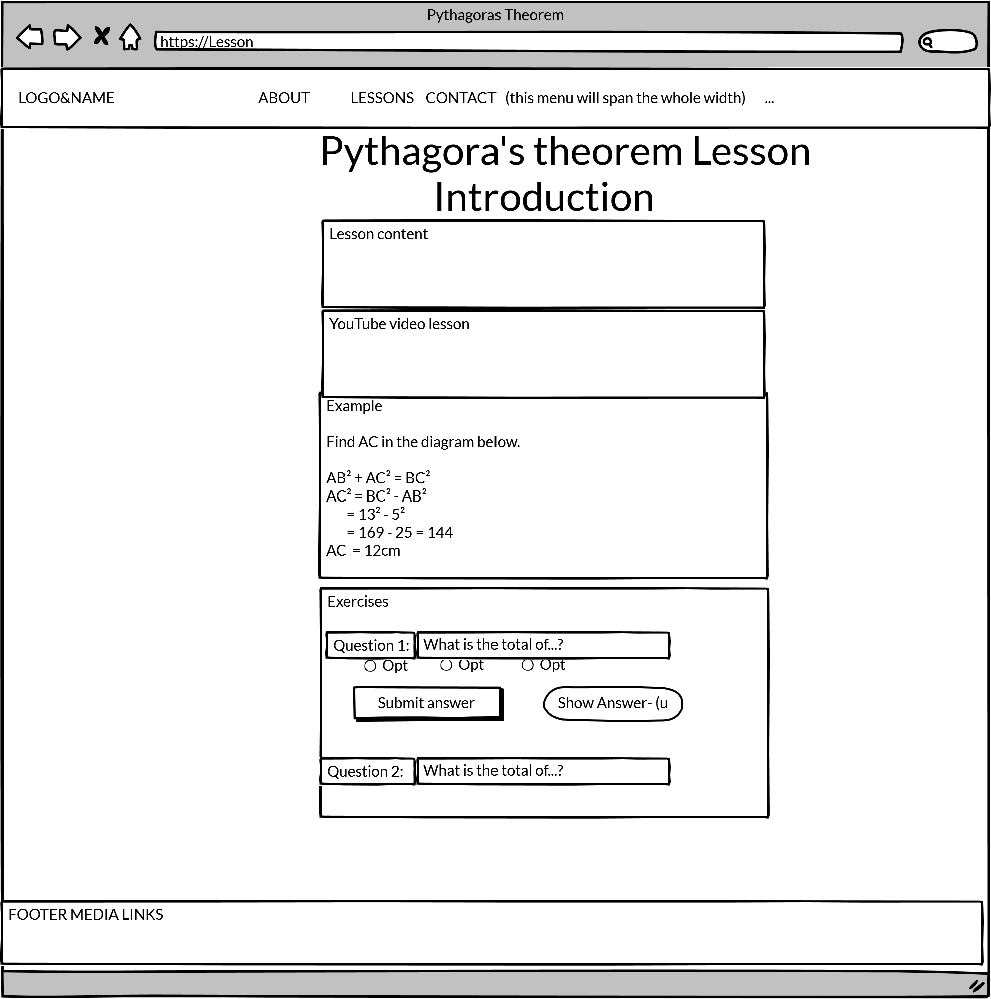

# IO-Math-Lessons

The live website of **IO-Math-Lessons** can be viewed <a href="https://emusat2021.github.io/IO-Math-Lessons" target="_blank">here</a>

1st milestone project: User-Centric Frontend Development - <a href="https://codeinstitute.net/" target="_blank">Code Institute</a> assignment project.

This is an non profit organisation "IO Math Lessons" who provides websites with math lessons.
The math lessons are intended to be used for pupils in secondary school (5th to 9th grade) in order to help them learn a math lesson more easily.
 
Pythagora's theorem is the first lesson offered by **_IO Math Lessons_**.

The lesson is presenting Pythagora's theorem as well as images for better understanding, video and exercises.

This website gives the opportunity to contact IO Math Lessons and it is providing a form to send messages with a posible lesson request.

See IO Math Lessons offical website <a href="https://emusat2021.github.io/IO-Math-Lessons" target="_blank">here</a>

1. [UX](#ux)
  * [Users stories](#users-stories)
    + [First Time Visitor Goals](#first-time-visitor-goals)
    + [Returning Visitor Goals](#returning-visitor-goals)
    + [Frequent User Goals](#frequent-user-goals)
  * [Design](#design)
2. [Features](#features)
  * [Existing Features](#existing-features)
    + [Navbar](#navbar)
    + [Images](#images)
    + [Video](#video)
    + [Forms](#forms)
    + [Favicon](#favicon)
    + [Sign-up modal](#sign-up-modal)
    + [Footer](#footer)
    + [About page](#about-page)
    + [Lesson menu](#lesson-menu)
    + [Lesson-1 page](#lesson-1-page)
    + [Contact page](#contact-page)
  * [Features Left to Implement](#features-left-to-implement)
3. [Technologies Used](#technologies-used)
  * [Languages Used](#languages-used)
  * [Frameworks, Libraries, Programs Used & other tools](#frameworks--libraries--programs-used---other-tools)
4. [Testing](#testing)
  * [Validators](#validators)
    + [HTML](#html)
    + [CSS](#css)
    + [Responsiveness](#responsiveness)
  * [Testing User Stories from User Experience (UX) Section](#testing-user-stories-from-user-experience--ux--section)
  * [Further Testing](#further-testing)
5. [Deployment](#deployment)
6. [Credits](#credits)
  * [Code](#code)
  * [Content](#content)
  * [Media](#media)
  * [Acknowledgements](#acknowledgements)
7. [Disclaimer](#disclaimer)

## UX
### Users stories
#### First Time Visitor Goals

As a... | I want to... | To be able to...
---------|--------------|--------------
First Time Visitor | be able to easily navigate throughout the site | find content
First Time Visitor | look for testimonials | to understand what their users think of them and see if they are trusted
First Time Visitor | locate their social media links | see their followings on social media to determine how trusted and known they are
First Time Visitor | Understand math lessons | To demonstrate knowledge at school

#### Returning Visitor Goals
As a... | I want to... | To be able to...
---------|--------------|--------------
Returning Visitor | Practice with excercises | Test my knowledge
Returning Visitor | Have a readable lesson | Easily understand the info presented
Returning Visitor | find the best way to get in contact with the organisation | get answers to any questions I may have
Returning Visitor | be notified when new lessons are available | stay updated

#### Frequent User Goals
As a... | I want to... | To be able to...
---------|--------------|--------------
Frequent User | check to see if there are any newly added lessons | stay informed
Frequent User | See my test results | Have feedback on my learning progress

### Design

The goal in design was to create a website for a math lesson that is overall user friendly. 
The pupil will easily understand the info presented.
The pupil will practice with excercises.
The color of the backgroud, video, images will capture the pupil's attention to the lesson and make the lesson more interesting. 

**Wireframes**:

## Features

### Existing Features

#### Navbar
- Navbar at the top - helping user to easily navigate to diferent pages.
- Fixed navigation bar visible on every page including a dropdown menu.
- Sign up link for newsletter.
#### Images
Images with Pythagora's teorem which bring more ease to understand the lesson.
#### Video
The video from the "Lesson" page is to capture the pupil's attention to the lesson and make the lesson more interesting.
#### Forms
- Forms are used to create a test in the "Lesson and Exercises" page for the pupil to asses him/herself at the end of the lesson. 
- There are buttons that are providing correct answers, as well, for test feedback. 
- When the "Click here for answer" button is clicked, a collapsed div is shown, containing the answer and an explanation. The collapsed div was realized using Bootstrap.
#### Favicon 
- A favorite icon has been implemented so that a user can recognize the logo on the browser tab.
#### Sign-up modal
A sign-up modal is presented in all pages. The sign-up can be accessed via the Navbar. It is realised using Bootstrap.
#### Footer
The footer is styled using Bootstrap. It contains links to social media as well as a disclaimer and a copyright note.
#### About page
* Short presentation about IO Math Lessons.
* Testimonials from users.
#### Lesson menu
This is a dropdown menu where you can find the list of all Lesson.
Only the first lesson is created (Pythagora's theorem). 
The site is designed in such a way that future lessons can be easily added by creating a separate html file containing the lesson and linking the lesson within the Navbar.
#### Lesson-1 page
This is the first lesson named **Pythagora's theorem**. 
The following pieces of information are on this page:
* Introduction
  * A basic presentation of Pythagora's theorem;
  * Formula for the theorem and a diagram;
  * A video where another exemple is presented in order for pupil to understand the theorem.
* Example
  * A practical example of how to calculate a triangle's side using the theorem.
* Exercises
  * A test with three exercises where the pupil can test the knowledge of the theorem.
  * Possibility for the pupil to fill in an answer calculated by him/herself.
  * Possibility for the pupil to choose the correct answer.

#### Contact page 
The following pieces of information are on this page:
* Who are we?
* What do we currently offer?
* Contact details with address and telephone number.
* A form for users to suggest other lessons that they might want.

### Features Left to Implement

* One of the improvments that can be done is to provide a submit button for the "Exercises" page and use JavaScript to auto-grade the test.
* Another feature that can be implemented is back-end logic for contact and sign-up form to make those features fully functional.
* Add more lessons to make the site more attractive.

 
## Technologies Used

### Languages Used

* The app was created using HTML5 styled with custom CSS3 styles.
* The logic scripts were written in JavaScript.

### Frameworks, Libraries, Programs Used & other tools 

1. <a href="https://getbootstrap.com/docs/4.6/getting-started/introduction/" target="_blank">Bootstrap 4.6:</a>
* Bootstrap 4.6 css was used to create the navigation bar, as well as 'Exercises' page, responsive design, etc.
2. <a href="https://fonts.google.com/" target="_blank">Google Fonts:</a>
* Google fonts were used to import the Roboto font into the style.css file which is used on all text elements of the app.
3. <a href="https://azure-loon-ay9p18v0.ws-eu03.gitpod.io/#/workspace/IO-Math-Lessons" target="_blank">Git:</a>
* Git was used for version control by commiting to local repository and pushing to GitHub.
4. <a href="https://github.com/" target="_blank">GitHub:</a>
* GitHub was used to store the project's code after being pushed from local repository.
5. <a href="https://balsamiq.com/wireframes/desktop/#" target="_blank">Balsamiq:</a>
* Balsamiq was used to create the wireframes shown above for the front end design.
6. <a href="https://ecotrust-canada.github.io/markdown-toc/" target="_blank">Markdown TOC generator</a>
7. <a href="https://secure.logomaker.com/myprojects" target="_blank">Logo</a>
* The logo was generated using logomaker.com online service

## Testing
### Validators
#### HTML
All the HTML files were tested through <a href="https://validator.w3.org/#validate_by_input" target="_blank">W3C Markup Validation Service</a>. 
One error was found in index.html as follows:

The error was corrected by adding the missing div.
#### CSS
CSS files were tested through <a href="https://jigsaw.w3.org/css-validator/" target="_blank">W3C CSS Validation Service</a>.
One error was found in the css file as follows:

The error was corrected by removing the comma after h1 styling.

#### Responsiveness
I used <a href="http://ami.responsivedesign.is/" target="_blank">Am I Responsive</a> online tool for checking responsiveness on different devices. The website is displayed properly across different devices.

### Testing User Stories from User Experience (UX) Section
* __First Time Visitor__

* As a First Time Visitor I want to be able to easily navigate throughout the site to be able to find content.

At the top of each page there is a clean navigation bar, each link describes what the page they will end up at clearly.

* As a First Time Visitor I want to look for testimonials to be able to to understand what their users think of them and see if they are trusted.

The Testimonials can easily be found in the About page.

* As a First Time Visitor I want to locate their social media links to be able to see their followings on social media to determine how trusted and known they are.

The social media links are located at the bottom of each page in the footer.

* As a First Time Visitor I want to understand math lessons to be able to demonstrate knowledge at school.

The lesson is written in a clear and concise manner, providing pictures and video.

* __Returning Visitor__

* As a Returning Visitor I want to practice with excercises to be able to test my knowledge.

The radio buttons were tested and they perform as axpected. The collapsed divs with answers are revealed when clicking on the "Click here for correct answer" button in lesson-1.html.

* As a Returning Visitor I want to have a readable lesson to be able to easily understand the info presented.

All divs were tested with the help of css "debug" class and were displayed properly. 

* As a Returning Visitor I want to find the best way to get in contact with the organisation to be able to get answers to any questions I may have.

There are Contact details with address and telephone number on the Contact page. The form for users to suggest other lessons that they might want is functioning properly.

* As a Returning Visitor I want to be notified when new lessons are available in order to stay updated.

There is a "Sign up" button in the menu as well as a "Sign up" link in the About page. When the user clicks on either of them, a modal pops up asking the user to register for the news letter.

* __Frequent User__

* As a Frequent User I want to check to see if there are any newly added lessons to be able to stay informed.

The user would already be comfortable with the website layout and can easily check the About page.

* As a Frequent User I want to see my test results to be able to have feedback on my learning progress.

The radio buttons were tested and they perform as axpected. The collapsed divs with answers are revealed when clicking on the "Click here for correct answer" button in lesson-1.html.

### Further Testing
- test that navbar is fixed on mobile on all pages.
- test that navbar is fixed on larger devices on all pages.
- test that container top margin is appropriate on mobile on all pages.
- test that container top is appropriate on larger devices on all pages.
- test that navbar collapse button on small devices is displayed properly.
- test that navbar collapsed content is fully expanded on small devices.
- test that the favorite icon is displayed in the browser tab.
- test that the radio buttons perform as axpected.
- test that all images are displayed as intended on different devices.

- test that all divs are displayed properly with the help of css "debug" class.
- test that collapsed divs with answers are revealed when clicking on the "Click here for correct answer" button in lesson-1.html.

## Deployment

GitHub Pages
The project was deployed to GitHub Pages using the following steps:

1. Logged in to GitHub and located the <a href="https://github.com/emusat2021/IO-Math-Lessons" target="_blank">GitHub Repository</a>
2. At the top of the Repository, located the "Settings" Button on the menu.
3. Scrolled down the Settings page until "GitHub Pages" Section was located.
3. Under "Source", clicked the dropdown called "None" and selected "Master Branch".
4. The page automatically refreshed.
5. Scrolled back down through the page to locate the now published site <a href="https://emusat2021.github.io/IO-Math-Lessons/" target="_blank">link</a> in the "GitHub Pages" section.

## Credits

### Code
* Code for navbar taken from  <a href="https://getbootstrap.com/docs/4.6/components/navbar/" target="_blank">getbootstrap.com</a> and eding slightly to fit project needs*/
* Code for section and form in Contact page from <a href="https://github.com/Code-Institute-Solutions/resume-miniproject-bootstrap4" target="_blank">Code Institute-Mini Project with Bootstrap 4 </a>
* Code for SIGN UP MODAL and link taken from <a href="https://irinatu17.github.io/Portishead" target="_blank">Portishead</a>
* Code for footer taken from <a href="https://github.com/Code-Institute-Solutions/resume-miniproject-bootstrap4/blob/master/09-adding-footer-content/index.html" target="_blank">resume-miniproject-bootstrap4</a>
* Code for footer with name <a href="https://irinatu17.github.io/Portishead" target="_blank">Portishead</a>
* Code for Testimonials taken from <a href="https://github.com/Code-Institute-Solutions/BootstrappingYourNextBigIdea-BS4/tree/master/04-BeyondBootstrap" target="_blank">BootstrappingYourNextBigIdea-BS4</a>

### Content

* The text for in Lessons for Lesson 1 - Pythagora's theorem, Introduction and Example was copied from the [revisionmaths.com](https://revisionmaths.com/gcse-maths-revision/trigonometry/pythagorass-theorem
)

### Media
* Teacher with pupils image from Home page <a href="https://raisingchildren.net.au/__data/assets/image/0032/48974/problem-solving-strategies-for-parents-and-teachernarrow.jpg" target="_blank">raisingchildren.net.au</a>;
* Diagram triangle image Lessons Lesson 1 - Pythagora's theorem page <a href="https://encrypted-tbn0.gstatic.com/images?q=tbn:ANd9GcRgxavlp2-18lF2fSK7dQZ8NHTiBIjZmzpZfA&usqp=CAU" target="_blank">gstatic.com</a>;
* Example triangle image Lessons Lesson 1 - Pythagora's theorem page <a href="https://encrypted-tbn0.gstatic.com/images?q=tbn:ANd9GcSwj8hQXL1f5VAA-kkm3JD4zEE7PxOp822FbQ&usqp=CAU" target="_blank">gstatic.com</a>;
* Logo image Contact page <a href="(https://secure.logomaker.com/myprojects" target="_blank">logomaker.com</a>;
* Video page 2 <a href="https://revisionmaths.com/gcse-maths-revision/trigonometry/pythagorass-theorem" target="_blank">revisionmaths.com</a>
### Acknowledgements
* I received inspiration for this project from my mentor <a href="https://www.codeinstitute.net/" target="_blank">Can Sücüllü](https://www.linkedin.com/in/cansucullu/?originalSubdomain=ie) at [Code Institute</a>.
* My husband Bogdan Musat and son David Musat for their immense support, patience and love!
* All friends and family that took the time to test this for me.

## Disclaimer
This site is made for educational purposes only.